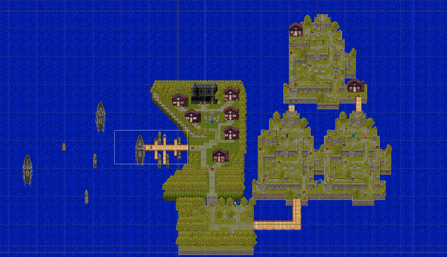
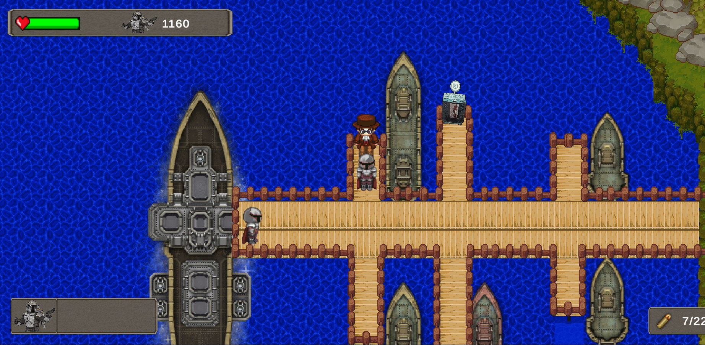

## Rescate de la princesa <!-- omit in toc -->

- Universidad de La Laguna
- **Master:** Desarrollo de Videojuegos
- **Asignatura:** Fundamento de Desarrollo de Videojuegos
- **Trabajo Final de Asignatura:** Creación de un juego arcade 2D en Unity

 

## Índice <!-- omit in toc -->

- [👨🏼‍💻 Autor](#-autores)
- [🗣 Introducción](#-introducción)
  - [Descripción del juego](#descripción-del-juego)
  - [Descripción del mapa](#descripción-del-mapa)
- [📝Estructura de los scripts](#estructura-de-los-scripts)
- [♥ Elementos externos usados](#-elementos-externos-usados)
- [🎮 Cuestiones importantes para el uso](#-cuestiones-importantes-para-el-uso)
- [📋 Hitos de programación logrados](#-hitos-de-programación-logrados)
- [😲 Aspectos destacables del juego](#-aspectos-destacables-del-juego)
- [🔧 Metodología de trabajo](#-metodología-de-trabajo)
- [📹 Gifs de demostración del juego](#-gifs-de-demostración-del-juego)
- [🔎 Enlaces de interés](#-enlaces-de-interés)
  - [Gameplay del juego](#gameplay-del-juego)
  - [APK](#apk)
  - [Github Proyecto completo](#github-proyecto-completo)
- [💡 Posibles mejoras a futuro](#-posibles-mejoras-a-futuro)

 

## 👨🏼‍💻 Autor
- Christian Torres González (alu0101137902)

 

## 🗣 Introducción

En el presente documento se redacta la información referente al juego arcade 2D que he creado para la asignatura Fundamento de Desarrollo de Videojuegos.

El juego se basa en los juegos arcade 2D pero con la peculiaridad de que esta desarrollado desde una vista **topdown** lo que significa que el juego se desarrolla en una perspectiva superior de tal forma que estaríamos viéndolo desde arriba.

De manera simplificada el objetivo del juego consiste en avanzar por diferentes zonas derrotando a los enemigos que nos vamos encontrando con la finalidad de llegar a una zona donde se encuentra retenido un personaje que tenemos que rescatar.

En cuanto a la implementación del juego, se han utilizado diferentes técnicas de creación de juegos arcade las cuales comentaré mas adelante en su sección correspondiente.

 

### Descripción del juego
Inicialmente cuando accedemos al juego se nos presentara un menú principal donde podremos seleccionar entre varias opciones, jugar (lo que iniciara el juego) y salir (que lo cerrará). Tras seleccionar la opción jugar, se producirá una pequeña transición que dará comienzo al juego.

En el momento de iniciar la partida nos encontraremos en los pantalanes de un pequeño puerto del pueblo al que hemos llegado tras el naufragio con nuestra nave debido a que esta se quedó sin combustible. En el puerto encontraremos diferentes objetos y personajes con los que podremos interactuar, entre los cuales encontraremos el piloto de nuestro barco, un ciudadano del pueblo que nos dará una serie de indicaciones y por ultimo una maquina que al interactuar con ella, nos dará la opción de poder comprar un objeto que otorgará una ventaja a nuestro jugador.

Tras abandonar el puerto y dirigirnos a la siguiente zona, encontraremos el pueblo al que tendremos que acudir en busca de nuestra misión principal. De la misma forma que en la zona anterior, encontraremos diversos objetos con los que podremos interactuar, el alcalde del pueblo que será quien nos encargue la misión principal, otra maquina que al interactuar con ella podremos comprar munición para nuestro arma, además de otros ciudadanos. De camino a este nueva zona tendremos que tener cuidado ya que nos podemos encontrar con diversos enemigos a los que tendremos que enfrentarnos.

Finalmente una vez tenemos nuestra misión principal asignada, nos tendremos que dirigir al castillo en el que se encuentra el objetivo. De camino al castillo tendremos que enfrentarnos a numerosos enemigos que nos dificultaran nuestra misión principal. Tras derrotarlos a todos y al jefe, llegaremos a lo alto del castillo donde encontraremos a la princesa que teníamos que rescatar.

> NOTA: sólo contarás con tu arma y tu capacidad de supervivencia para poder conseguir el objetivo

### Descripción del mapa
El mapa en el que se desarrolla el juego ha sido desarrollado completamente desde cero usando diferentes assets incluidos en los tilempas extraídos de diferentes sitios (Asset Store e internet). 

A su vez, se encuentra dividido en tres principales zonas:
- **Puerto:** es la zona de inicio del juego. En ella encontraremos diferentes elementos con los que podremos interactuar y que nos otorgaran información referente a nuestra misión.
- **Pueblo:** es la zona central del mapa y donde se encuentra el objetivo al que tendremos que acudir para obtener mas información sobre como poder cumplir nuestro objetivo.
- **Castillo:** es la zona principal donde se desarrolla el juego ya que es donde se encuentra el objetivo que nos permitirá lograr cumplir nuestra misión, es por eso que esta repleto de enemigos.

 

## 📝Estructura de los scripts

- Bullet
  - [BulletScript.cs](./Scripts/Bullet/BulletScript.cs)
- Cámara
  - [CameraFollow.cs](./Scripts/Camera/CameraFollow.cs)
- Canvas
  - [CanvasAmmoSystem.cs](./Scripts/Canvas/CanvasAmmoSystem.cs)
  - [CanvasLifeSystem.cs](./Scripts/Canvas/CanvasLifeSystem.cs)
  - [CanvasPerks.cs](./Scripts/Canvas/CanvasPerks.cs)
  - [CanvasPlayerPoints.cs](./Scripts/Canvas/CanvasPlayerPoints.cs)
  - [CanvasPlayerRevive.cs](./Scripts/Canvas/CanvasPlayerRevive.cs)
  - [CanvasReloadWeapon.cs](./Scripts/Canvas/CanvasReloadWeapon.cs)
- Ciudadanos
  - [Alcalde.cs](./Scripts/Ciudadanos/Alcalde.cs)
  - [NPCPatroling.cs](./Scripts/Ciudadanos/NPCPatroling.cs)
  - [Piloto.cs](./Scripts/Ciudadanos/Piloto.cs)
- Diálogos
  - [Dialogue.cs](./Scripts/Dialogos/Dialogue.cs)
  - [DialogueManager.cs](./Scripts/Dialogos/DialogueManager.cs)
- Enemigos
  - [DragonAttack.cs](./Scripts/Enemy/DragonAttack.cs)
  - [DragonDamage.cs](./Scripts/Enemy/DragonDamage.cs)
  - [DragonLife.cs](./Scripts/Enemy/DragonLife.cs)
  - [DragonPatrol.cs](./Scripts/Enemy/DragonPatrol.cs)
- Lógica
  - [ControladorDelegados.cs](./Scripts/Controller/ControladorDelegados.cs)
- Menú
  - [FadeInOut.cs](./Scripts/Menu/FadeInOut.cs)
  - [Menu.cs](./Scripts/Menu/Menu.cs)
- Perks
  - [AmmoMachine.cs](./Scripts/Perks/AmmoMachine.cs)
  - [DoubleTap.cs](./Scripts/Perks/DoubleTap.cs)
  - [PerkManager.cs](./Scripts/Perks/PerkManager.cs)
  - [QuickRevive.cs](./Scripts/Perks/QuickRevive.cs)
  - [SpeedCola.cs](./Scripts/Perks/SpeedCola.cs)
- Player
  - [PlayerController.cs](./Scripts/Player/PlayerController.cs)
  - [PlayerDamage.cs](./Scripts/Player/PlayerDamage.cs)
  - [PlayerLife.cs](./Scripts/Player/PlayerLife.cs)
  - [PlayerPerks.cs](./Scripts/Player/PlayerPerks.cs)
  - [PlayerPoints.cs](./Scripts/Player/PlayerPoints.cs)
  - [PlayerShoot.cs](./Scripts/Player/PlayerShoot.cs)
- Weapons
  - [CollectWeapon.cs](./Scripts/Weapons/CollectWeapon.cs)
  - [Weapon.cs](./Scripts/Weapons/Weapon.cs)
  - [WeaponFusil.cs](./Scripts/Weapons/WeaponFusil.cs)
  - [WeaponPistol.cs](./Scripts/Weapons/WeaponPistol.cs)

 

## ♥ Elementos externos usados

Para el desarrollo del juego se han usado elementos externos conseguidos en la **Asset Store** como otros elementos de internet como bien han sido los sprites 2D:

- Modelos de internet
  - Sprites del personaje
  - Sprites de las maquinas de ventajas
  - Sprites de los barcos del puerto
  - Sprites de los ciudadanos incluidos en el pueblo

- Modelos de la asset store
  - Sprites de los dragones enemigos
  - Cuadros de texto de los diálogos

 

## 🎮 Controles del juego

El juego se encuentra principalmente enfocado en la plataforma de PC, por lo que el movimiento del personaje se llevara a cabo con teclado y ratón.

Combinación de teclas y botones:
**- Movimiento del personaje:** teclas WASD
**- Disparo del personaje:** botón izquierdo del ratón sobre cualquier punto del mapa

 

## 📋 Hitos de programación logrados

En este juego se han aplicado muchas de las técnicas aprendidas en la asignatura y otras nuevas aprendidas a lo largo de la realización del proyecto.

- Todo los sistemas con los que cuenta el personaje (vida, puntos, ventajas (perks) y armas)  se activarán a través de métodos **delegados** para aumentar nuestra vida o poder, cambiar de armas, o comprar ventajas de las maquinas.
- El juego cuenta con un sistema de diálogos implementado donde el texto se va mostrando progresivamente y tienes que ir interactuando para ir leyendo la conversación que nos muestra el personaje. Además de que algunos objetos además del dialogo, también cuentan con un sistema para poder interactuar con ellos. Cada personaje tiene sus propios textos de tal forma que las conversaciones no se repetirán dando mayor variedad y dinamicidad al juego.
- Los personajes cuentan con diferentes animaciones a la hora de moverse, atacar o a la hora de morir. Se producirán diferentes animaciones en función del nivel de vida o de la acción a realizar por el personaje.
- Uso de diferentes tilemaps para crear las diferentes zonas del mapa, además de los diferentes objetos con los que este cuenta
- Cambio de **escenas**

 

## 😲 Aspectos destacables del juego

- En los cambios de menús (inicio del juego y menú final cuando se terminan las vidas) se produce un desvanecimiento que hace que el cambio no sea brusco para el jugador
- Las balas que dispara el arma del jugador se disparan a la posición que el jugador desea pulsando con el ratón en el mapa. Inicialmente, solo se podía disparar en la dirección en la que se encontraba el jugador, es decir, arriba, abajo, izquierda, derecha y las diagonales, pero esto suponía una mayor dificultad a la hora de disparar a los enemigos porque tenias que estar en su dirección, además de que a nivel de jugabilidad la empeoraba bastante.
- En el momento en el que rescatamos al personaje, este comienza a seguirnos y se ve mas realista ya que también tiene animaciones de movimiento.
- Uso de Rigidbody2D para movimientos y colisiones más realistas
- Presencia de NPC ciudadanos en el pueblo para darle una mejor dinamicidad e inmersión en el juego
- Animaciones en el juego como los dragones cuando nos persiguen, los matamos o cuando están en su lugar.

 

## 🔧 Metodología de trabajo

Para el desarrollo del proyecto en cuanto a la metodología de trabajo, he desarrollado el juego centrándome en cada uno de los objetos que podemos encontrar en el juego, es decir, primero me centre en crear y darle vida al personaje y todos sus sistemas de vida, armas, puntos, etc. Una vez lo tenia todo terminado, pasé a la creación del mapa y las diferentes zonas en las que este se divide. Tras crear el mapa lo siguiente en lo que me centre, fue en la creación de las ventajas que podemos encontrar por el mapa. Finalmente lo ultimo en lo que me centre una vez tenia todo lo anterior creado, fueron el canvas que podemos encontrar al jugar y el sistema de diálogos al interactuar con los diferentes objetos del juego.

Para llevar un control de todo el trabajo he usado **git** para el control de versiones del proyecto y **github** como plataforma para alojarlo en la nube y así de esta manera poder tener un control mayor del proyecto.

 

## 📹 Gifs de demostración del juego

En los siguientes gifs e imágenes podremos ver diferentes acciones que podemos tener en el juego.

- Mapa 
  - Imagen desde arriba del mapa
  
    

- Jugador
  - Movimiento del jugador
  
    

  - Disparo del jugador

    

- Dragon enemigo y disparo
 
  
  
- Dialogo con personajes
  
  

- Comprar ventaja de maquina
  
  
  
 

## 🔎 Enlaces de interés

### Gameplay del juego
En el siguiente enlace pueden encontrar un video de demostración del juego donde se demuestran todo lo creado en este proyecto:

- [Enlace al gameplay](https://youtu.be/DZN83pzJXsw)

### APK

En este enlace encontrarán la apk del juego para Android para poder descargarla y probarlo:

- [Enlace a la APK](https://github.com/ChristianTorresGonzalez/FDV_ProyectoFinal_Juego2D.git)

### Github Proyecto completo

En el siguiente enlace encontrarán un repositorio de Github donde se encuentra todo el proyecto completo para poder descargarlo y ejecutarlo en Unity, para dicho repositorio se ha hecho uso de la herramienta Git LFS debido al peso de los archivos con los que cuenta el proyecto:

- [Enlace a repositorio del proyecto en Unity](https://github.com/ChristianTorresGonzalez/FDV_ProyectoFinal_Juego2D.git)
  
 

## 💡 Posibles mejoras a futuro

- Sería interesante tener una base de datos para guardar información del progreso del
jugador ya sea una relacional o una no relacional. De esta manera si cerramos el juego y volvemos podemos seguir desde el punto que lo dejamos, guardando los datos como el lugar donde lo dejamos, vida, misiones conseguidas, etc.

- Crear mis propios modelos de los sprites para usar en el juego.

- Una posible opción seria la de lanzar el juego en otras plataformas por lo que se configurarían los controles a dicha plataforma.

- Otra cosa que sería interesante es poder publicar el juego, sería una buena idea pero no sin haber implementado las mejoras anteriormente comentadas.
